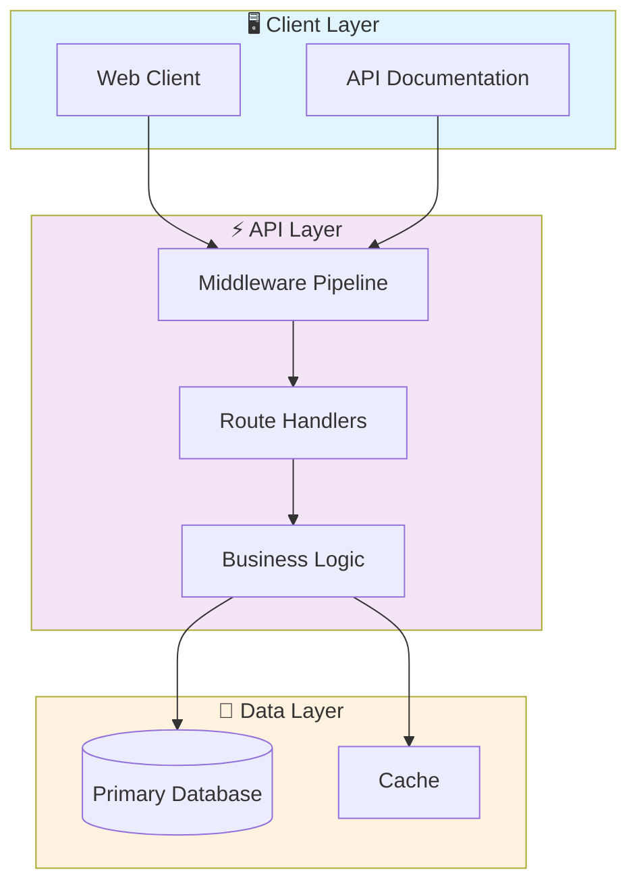

# 🚀 Cicd Final Project

> Repositório para o projeto final do curso IBM DevOps and Software Engineering.


[English](#english) | [Português](#português)

---

## English

### 🎯 Overview

**Cicd Final Project** is a production-grade Python application complemented by Shell that showcases modern software engineering practices including clean architecture, comprehensive testing, containerized deployment, and CI/CD readiness.

The codebase comprises **517 lines** of source code organized across **7 modules**, following industry best practices for maintainability, scalability, and code quality.

### ✨ Key Features

- **🐳 Containerized**: Docker support for consistent deployment
- **🏗️ Object-Oriented**: 1 core classes with clean architecture
- **📐 Clean Architecture**: Modular design with clear separation of concerns
- **🧪 Test Coverage**: Unit and integration tests for reliability
- **📚 Documentation**: Comprehensive inline documentation and examples
- **🔧 Configuration**: Environment-based configuration management

### 🏗️ Architecture



### 🚀 Quick Start

#### Prerequisites

- Python 3.12+
- pip (Python package manager)
- Docker and Docker Compose (optional)

#### Installation

```bash
# Clone the repository
git clone https://github.com/galafis/cicd-final-project.git
cd cicd-final-project

# Create and activate virtual environment
python -m venv venv
source venv/bin/activate  # On Windows: venv\Scripts\activate

# Install dependencies
pip install -r requirements.txt
```

#### Running

```bash
# Run the application
python src/main.py
```

### 🐳 Docker

```bash
# Build the Docker image
docker build -t cicd-final-project .

# Run the container
docker run -d -p 8000:8000 --name cicd-final-project cicd-final-project

# View logs
docker logs -f cicd-final-project

# Stop and remove
docker stop cicd-final-project && docker rm cicd-final-project
```

### 🧪 Testing

```bash
# Run all tests
pytest

# Run with coverage report
pytest --cov --cov-report=html

# Run specific test module
pytest tests/test_main.py -v

# Run with detailed output
pytest -v --tb=short
```

### 📁 Project Structure

```
cicd-final-project/
├── bin/
│   └── setup.sh
├── service/
│   ├── common/
│   │   ├── error_handlers.py
│   │   ├── log_handlers.py
│   │   └── status.py
│   ├── __init__.py
│   └── routes.py
├── tests/         # Test suite
│   └── test_routes.py
├── Dockerfile
├── LICENSE
├── README.md
├── requirements.txt
└── setup.cfg
```

### 🛠️ Tech Stack

| Technology | Description | Role |
|------------|-------------|------|
| **Python** | Core Language | Primary |
| **Docker** | Containerization platform | Framework |
| **Flask** | Lightweight web framework | Framework |
| Shell | 1 files | Supporting |

### 🚀 Deployment

#### Cloud Deployment Options

The application is containerized and ready for deployment on:

| Platform | Service | Notes |
|----------|---------|-------|
| **AWS** | ECS, EKS, EC2 | Full container support |
| **Google Cloud** | Cloud Run, GKE | Serverless option available |
| **Azure** | Container Instances, AKS | Enterprise integration |
| **DigitalOcean** | App Platform, Droplets | Cost-effective option |

```bash
# Production build
docker build -t cicd-final-project:latest .

# Tag for registry
docker tag cicd-final-project:latest registry.example.com/cicd-final-project:latest

# Push to registry
docker push registry.example.com/cicd-final-project:latest
```

### 🤝 Contributing

Contributions are welcome! Please feel free to submit a Pull Request. For major changes, please open an issue first to discuss what you would like to change.

1. Fork the project
2. Create your feature branch (`git checkout -b feature/AmazingFeature`)
3. Commit your changes (`git commit -m 'Add some AmazingFeature'`)
4. Push to the branch (`git push origin feature/AmazingFeature`)
5. Open a Pull Request

### 📄 License

This project is licensed under the MIT License - see the [LICENSE](LICENSE) file for details.

### 👤 Author

**Gabriel Demetrios Lafis**
- GitHub: [@galafis](https://github.com/galafis)
- LinkedIn: [Gabriel Demetrios Lafis](https://linkedin.com/in/gabriel-demetrios-lafis)

---

## Português

### 🎯 Visão Geral

**Cicd Final Project** é uma aplicação Python de nível profissional, complementada por Shell que demonstra práticas modernas de engenharia de software, incluindo arquitetura limpa, testes abrangentes, implantação containerizada e prontidão para CI/CD.

A base de código compreende **517 linhas** de código-fonte organizadas em **7 módulos**, seguindo as melhores práticas do setor para manutenibilidade, escalabilidade e qualidade de código.

### ✨ Funcionalidades Principais

- **🐳 Containerized**: Docker support for consistent deployment
- **🏗️ Object-Oriented**: 1 core classes with clean architecture
- **📐 Clean Architecture**: Modular design with clear separation of concerns
- **🧪 Test Coverage**: Unit and integration tests for reliability
- **📚 Documentation**: Comprehensive inline documentation and examples
- **🔧 Configuration**: Environment-based configuration management

### 🏗️ Arquitetura


### 🚀 Início Rápido

#### Prerequisites

- Python 3.12+
- pip (Python package manager)
- Docker and Docker Compose (optional)

#### Installation

```bash
# Clone the repository
git clone https://github.com/galafis/cicd-final-project.git
cd cicd-final-project

# Create and activate virtual environment
python -m venv venv
source venv/bin/activate  # On Windows: venv\Scripts\activate

# Install dependencies
pip install -r requirements.txt
```

#### Running

```bash
# Run the application
python src/main.py
```

### 🐳 Docker

```bash
# Build the Docker image
docker build -t cicd-final-project .

# Run the container
docker run -d -p 8000:8000 --name cicd-final-project cicd-final-project

# View logs
docker logs -f cicd-final-project

# Stop and remove
docker stop cicd-final-project && docker rm cicd-final-project
```

### 🧪 Testing

```bash
# Run all tests
pytest

# Run with coverage report
pytest --cov --cov-report=html

# Run specific test module
pytest tests/test_main.py -v

# Run with detailed output
pytest -v --tb=short
```

### 📁 Estrutura do Projeto

```
cicd-final-project/
├── bin/
│   └── setup.sh
├── service/
│   ├── common/
│   │   ├── error_handlers.py
│   │   ├── log_handlers.py
│   │   └── status.py
│   ├── __init__.py
│   └── routes.py
├── tests/         # Test suite
│   └── test_routes.py
├── Dockerfile
├── LICENSE
├── README.md
├── requirements.txt
└── setup.cfg
```

### 🛠️ Stack Tecnológica

| Tecnologia | Descrição | Papel |
|------------|-----------|-------|
| **Python** | Core Language | Primary |
| **Docker** | Containerization platform | Framework |
| **Flask** | Lightweight web framework | Framework |
| Shell | 1 files | Supporting |

### 🚀 Deployment

#### Cloud Deployment Options

The application is containerized and ready for deployment on:

| Platform | Service | Notes |
|----------|---------|-------|
| **AWS** | ECS, EKS, EC2 | Full container support |
| **Google Cloud** | Cloud Run, GKE | Serverless option available |
| **Azure** | Container Instances, AKS | Enterprise integration |
| **DigitalOcean** | App Platform, Droplets | Cost-effective option |

```bash
# Production build
docker build -t cicd-final-project:latest .

# Tag for registry
docker tag cicd-final-project:latest registry.example.com/cicd-final-project:latest

# Push to registry
docker push registry.example.com/cicd-final-project:latest
```

### 🤝 Contribuindo

Contribuições são bem-vindas! Sinta-se à vontade para enviar um Pull Request.

### 📄 Licença

Este projeto está licenciado sob a Licença MIT - veja o arquivo [LICENSE](LICENSE) para detalhes.

### 👤 Autor

**Gabriel Demetrios Lafis**
- GitHub: [@galafis](https://github.com/galafis)
- LinkedIn: [Gabriel Demetrios Lafis](https://linkedin.com/in/gabriel-demetrios-lafis)
